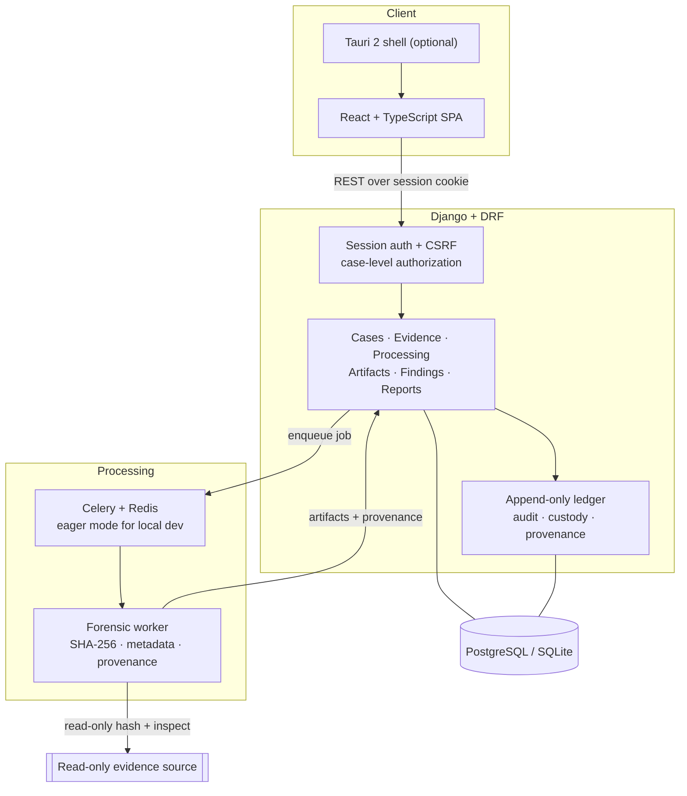

# System architecture

## Shape

A **modular monolith** for the case workflow, with processing pushed to a **separate
worker** so untrusted evidence is handled at arm's length. Services are split only when
a security boundary, scaling need, or ownership boundary justifies the cost.

- **Web UI** — one React application, served in the browser and (optionally) inside a
  Tauri shell. Talks to the API over REST with a session cookie.
- **API** — Django + DRF. System of record, session authentication, case authorization,
  and the append-only ledger. Owns all writes.
- **Worker** — a dependency-light Python service. Hashes and inspects evidence
  read-only, then reports runs, artifacts, and provenance back through the API.
- **Queue** — Celery over Redis for team deployments; **eager (synchronous) mode** for
  local development and tests, so no broker is required to exercise the full workflow.
- **Database** — PostgreSQL for teams, SQLite for local development.

## Invariants

- The worker never writes to original evidence and never logs raw evidence contents.
- The database is authoritative. Search — and any future index — is **derived and
  rebuildable**, with source pointers.
- Every write that matters produces an audit event in the same request/transaction.

## Deployment

Local: API + web dev server + SQLite + eager Celery. Team: API and worker under a
process supervisor, PostgreSQL, Redis, TLS termination, secret management, and restricted
evidence storage. See [10 deployment topology](diagrams/10-deployment-topology.md),
[13 deployment & operations](13-deployment-and-operations.md), and the
[ADRs](decisions/README.md).
