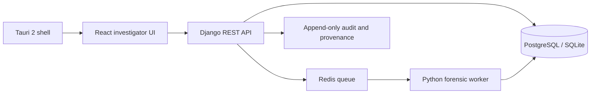

# System architecture

The browser and Tauri shell use the same React application. Django/DRF owns the system of record, session authentication, case authorization, and provenance. PostgreSQL is the intended team database; SQLite is a local fallback. Celery and Redis provide asynchronous processing, with eager synchronous mode for development.

See [deployment topology](diagrams/10-deployment-topology.md) and [ADRs](decisions/README.md).
