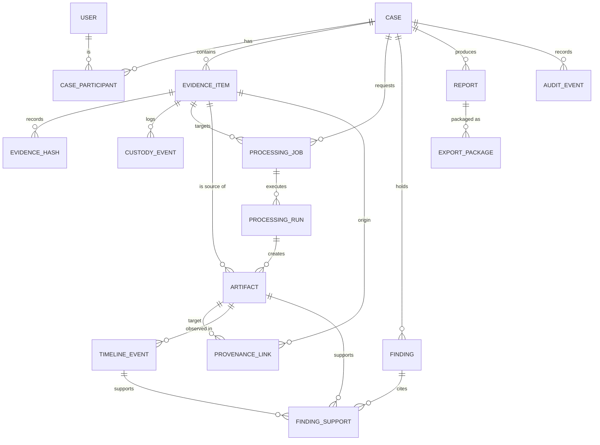

# Domain model

The model is split by capability across seven Django apps: `identity`, `cases`,
`evidence`, `processing`, `investigations`, `reporting`, `audit`.

## Conventions

Every model has a UUID primary key, `created_at` (and `updated_at` where it can
change), a case relationship where applicable, database indexes on the fields used to
filter, and an explicit `on_delete` policy. Raw evidence contents are never copied into
the model layer — only hashes, paths, and structured metadata.

## Entities

| App | Model | Notes |
| --- | --- | --- |
| identity | `User` | `AbstractUser` + UUID id, `display_name`, `role` (administrator, supervisor, investigator, reviewer, auditor, student) |
| cases | `Case` | unique `reference`, `status` (open/review/closed), `owner` |
| cases | `CaseParticipant` | `permission` (owner/edit/review/read); unique per (case, user) |
| evidence | `EvidenceItem` | `original_path`, `acquisition_metadata`, `expected_hash`, `calculated_hash`, `verification_status` (unverified/verified/mismatch/unreadable), `read_only` |
| evidence | `EvidenceHash` | one recorded hash value with algorithm and source |
| evidence | `CustodyEvent` | append-only; `action`, `actor`, `details`; ordered oldest-first |
| processing | `ProcessingJob` | `status` (queued/running/succeeded/failed), `error_message` |
| processing | `ProcessingRun` | one execution of a named/versioned processor; `warnings`, `errors` |
| investigations | `Artifact` | `content` (JSON), `artifact_type`, `processor_name`/`version`, `limitations`, `warnings` |
| investigations | `TimelineEvent` | `interpretation_status` (observed/normalized/suggestion/approved) |
| investigations | `ProvenanceLink` | `relationship` (default `derived_from`); unique per (source_evidence, artifact, relationship) |
| investigations | `Bookmark`, `InvestigatorNote` | model only in V0.1 |
| investigations | `Finding` | `examiner_status` (draft/approved/withdrawn), `review_status` (not_reviewed/in_review/reviewed) |
| investigations | `FindingSupport` | check constraint: at least one of `artifact` or `timeline_event` |
| reporting | `Report` | `body` (JSON snapshot), `status` |
| reporting | `ExportPackage` | `manifest_hash`, optional `report` |
| audit | `AuditEvent` | append-only; `actor`, `action`, `object_type`, `object_id`, `metadata`; newest-first |

## Relationships

## Deletion behavior

- Users referenced as `owner`, `registered_by`, `requested_by`, or `actor` are
  `PROTECT`ed — history keeps them undeletable.
- Deleting a `Case` cascades to its children.
- An `EvidenceItem` with custody events, processing jobs, artifacts, or provenance links
  is `PROTECT`ed — you cannot delete evidence that has derivations.
- Custody, provenance, and audit rows have no delete route at all.

Related: [05 Evidence lifecycle](05-evidence-lifecycle.md) ·
[06 Provenance & chain of custody](06-provenance-and-chain-of-custody.md).
