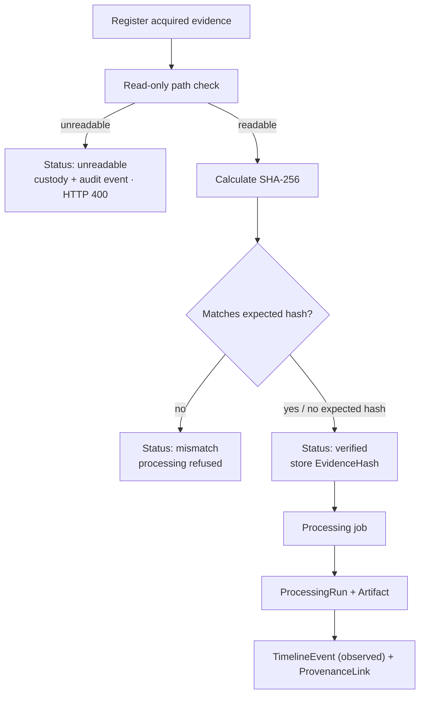

# Evidence lifecycle

How an item of evidence moves from registration to a provenance-linked artifact, and
where it stops.

## Stages

1. **Register.** `POST /api/cases/{id}/evidence/` records the logical source
   (`original_path`), `acquisition_metadata`, an optional `expected_hash`, and the
   registering user. A `CustodyEvent` (`action="registered"`) and an `AuditEvent`
   (`evidence.registered`) are written in the same transaction. `read_only` defaults to
   true.
2. **Verify.** `POST /api/evidence/{id}/verify/` opens the path read-only and streams
   SHA-256 in 1&nbsp;MiB chunks.
   - Path not readable → `verification_status = unreadable`, a
     `hash_verification_failed` custody event, an audit event, and `HTTP 400`.
   - Hash present and different → `verification_status = mismatch`.
   - Otherwise → `verification_status = verified`, and the value is stored as an
     `EvidenceHash` row.
   Either way a `hash_verified` custody event and an audit event are recorded.
3. **Process.** `POST /api/cases/{id}/jobs/` creates a `ProcessingJob` and dispatches
   the worker task. The worker re-checks readability, re-hashes, and **stops on a
   mismatch** (`ValueError`, job → `failed`).
4. **Produce.** On success the worker creates a `ProcessingRun`, an `Artifact` (basic
   file metadata: name, size, suffix), a `TimelineEvent` (`interpretation_status =
   observed`), and a `ProvenanceLink` (`relationship = derived_from`).

## Guarantees

- No V0.1 endpoint modifies or deletes original evidence.
- `verification_status` and `calculated_hash` are server-set; the client cannot write
  them (they are `read_only` on the serializer).
- Failure states (`unreadable`, `mismatch`, job `failed`) are distinct from "no result"
  and are recorded in both the custody and audit trails.

## Current limitation

Verification logic exists in two places — the `verify` endpoint and the worker task —
which both set `verification_status`. Consolidating these into one hash service is a
foundation-gate item; see [19 Phase 0 gap analysis](19-phase-0-gap-analysis.md).
