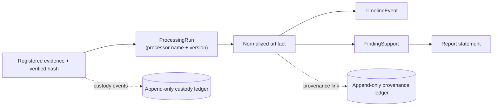

# Provenance and chain of custody

Two append-only records sit under the whole workflow. They answer different questions:

| | Question it answers | Model |
| --- | --- | --- |
| **Chain of custody** | *Who did what to this evidence, and when?* | `evidence.CustodyEvent` |
| **Provenance** | *Where did this derived record come from?* | `investigations.ProvenanceLink` |

## Chain of custody

A `CustodyEvent` records `action`, `actor`, `details`, and `created_at`, ordered
oldest-first. Events are written by the application on registration and on every
verification outcome (`registered`, `hash_verified`, `hash_verification_failed`). There
is no API route to edit or delete them.

## Provenance

A `ProvenanceLink` connects a `source_evidence` item to a derived `artifact` with a
`relationship` (default `derived_from`) and a free-text `rationale`. The processing
worker creates one for every artifact it produces. The triple
`(source_evidence, artifact, relationship)` is unique.

**Missing provenance is a review state, not an inference.** If an artifact has no
provenance link, the UI shows that as something to resolve — it never guesses a
relationship.

## Why it is modelled separately

A dedicated `ProvenanceLink` (rather than an implicit foreign key) lets the API, the UI,
and a future export manifest make traceability **explicit and testable** — you can query
"show every finding whose support chain does not reach verified evidence". See
[ADR-009](decisions/009-provenance-first.md).

## Toward the reproducibility package

The intended export package binds evidence identifiers, hashes, processor/rule versions,
parameters, source references, and recorded limitations so a reviewer can reconstruct
the method. V0.1 ships the export **endpoint as a placeholder** (it returns a receipt,
emits no file); the data it would need already exists in the models above.
