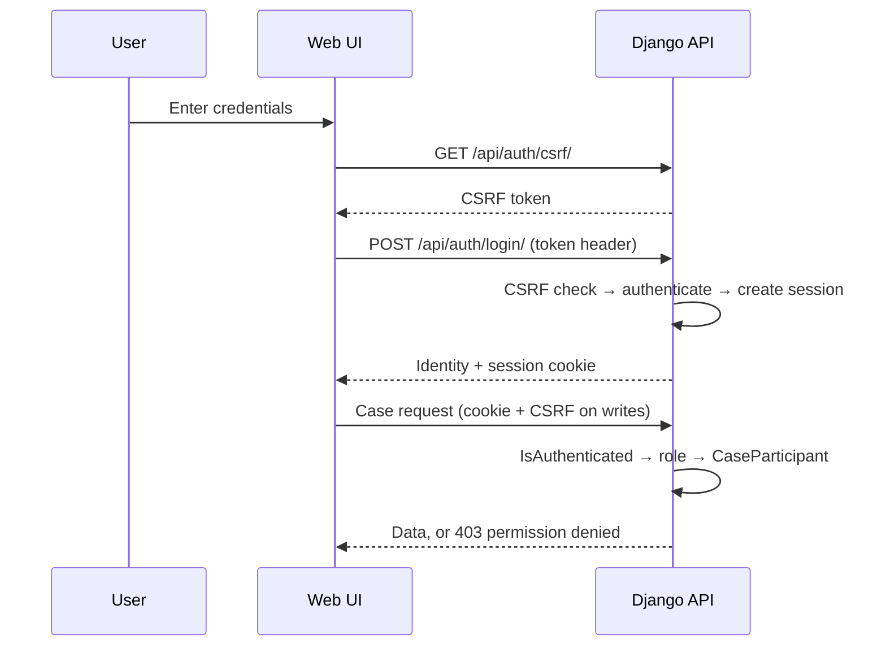

# Authentication and authorization

## Authentication

V0.1 uses **Django session authentication** with a custom user model
(`identity.User`), secure password hashing, CSRF protection, and `HttpOnly` /
`SameSite=Lax` cookies. `SESSION_COOKIE_SECURE` and `CSRF_COOKIE_SECURE` follow `DEBUG`
(on in production). CORS and CSRF trusted origins are an explicit allowlist from the
environment. There are no bearer tokens and nothing is stored in `localStorage`.

Login flow: the client fetches a CSRF token from `GET /api/auth/csrf/`, then
`POST /api/auth/login/` with the token header. The endpoint runs an explicit CSRF check,
authenticates, and creates the session. `POST /api/auth/logout/` ends it.
`GET /api/auth/me/` returns the current identity and role.

## Authorization

Two layers, checked in `cases.permissions.has_case_access(user, case, write=False)`:

1. **Role.** `administrator` (and Django superusers) bypass case membership.
2. **Case membership.** Everyone else must have a `CaseParticipant` row. `read` grants
   read; `owner`, `edit`, and `review` grant write.

Every data route calls this check. Write routes pass `write=True`. Roles beyond
`administrator` (`supervisor`, `reviewer`, `auditor`, `student`) exist on the user model
as the extension point for future role-specific rules; V0.1 enforces the
administrator-vs-participant split only.

## Known limitations

- No endpoint yet to add or remove `CaseParticipant` rows — case sharing is set up in
  the admin or a shell.
- `has_case_access` reads `user.role`; routes are protected by `IsAuthenticated` first,
  so an anonymous user is rejected before that attribute is read.

Related: [10 Security threat model](10-security-threat-model.md) ·
[08 Case permission model](diagrams/08-case-permission-model.md).
