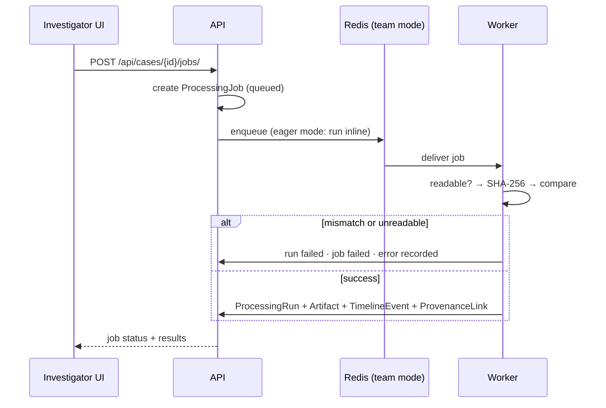

# Processing jobs

## Worker interface

The worker boundary (`services/forensic-worker/worker.py`) exposes:

`submit_job` · `get_job_status` · `process_evidence` · `record_processing_run` ·
`record_artifact` · `record_provenance` · `record_failure`

`process_evidence(path, expected_hash="")` is the implemented core: it confirms the path
is readable, streams SHA-256, compares against `expected_hash` if given, and returns a
`ProcessingResult` (`status`, `calculated_hash`, `warnings`, `error`). It never opens
evidence for writing and never returns raw contents.

## Execution model

The API-side task is `processing.tasks.process_evidence_job(job_id)`, a Celery
`shared_task`.

- **Team mode.** Celery dispatches through Redis; the job runs out of process.
- **Local / test mode.** `CELERY_TASK_ALWAYS_EAGER=True` runs the task inline, so the
  full workflow and its tests need no broker.

## Job and run states

`ProcessingJob.status`: `queued → running → succeeded | failed`.
`ProcessingRun.status`: `running → succeeded | failed`, with `warnings` and `errors`
as JSON lists and a `finished_at` timestamp.

## V0.1 processor

One processor only: `basic-metadata` v0.1.0. It records file name, size in bytes, and
lowercased suffix, and stamps the artifact with
`limitations = ["Basic metadata only; no complete forensic parser was used."]`. This is
software behaviour, not a validated forensic parser.

Related: [05 Processing-job sequence](diagrams/05-processing-job-sequence.md) ·
[ADR-006](decisions/006-worker-separation.md) · [ADR-007](decisions/007-celery-redis.md).
