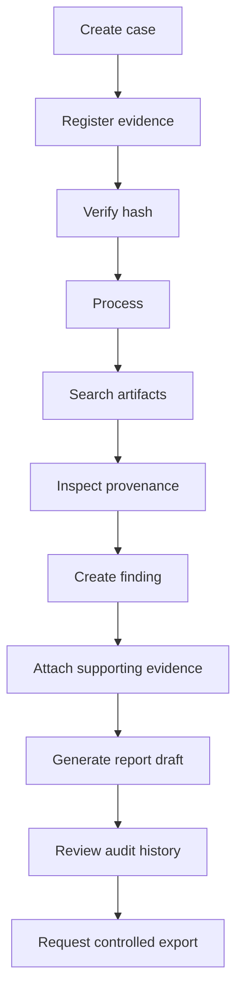

# User workflows

The interface exposes loading, empty, processing, failure, denied, unsupported, mismatch, verified, no-findings, missing-provenance, and unsaved-change states as the product matures.
