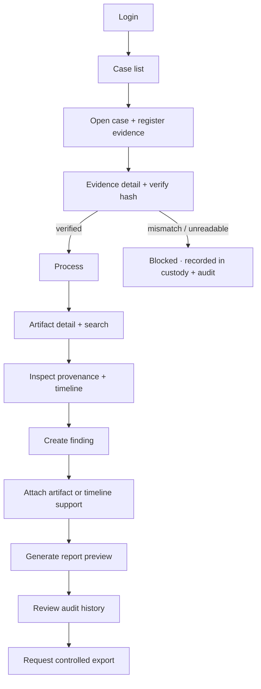

# User workflows

## The core loop

## In the current web UI

The workspace is a routed case list and selected-case workspace. Its sidebar makes the
journey explicit: Overview, Evidence, Artifacts, Timeline, Findings, Report, and Audit.
Evidence and artifacts open dedicated detail panels; reports are labelled development
previews and audit history includes global login/logout events as well as case actions.

Login and demo credentials are in the [README](../README.md#3-run-the-web-app).

## Interface states

The product's target is to make each of these visible and distinct:

loading · empty results · processing · processing failure · permission denied ·
unsupported evidence · hash mismatch · successful verification · no findings ·
missing provenance · unsaved changes.

Step 2 shows loading, error, empty, verified, mismatch, processing, limitation, missing
support, and synthetic-data states. Unsaved-change handling remains outside the current
scope because the available writes are explicit actions.

Related: [02 User investigation workflow diagram](diagrams/02-user-investigation-workflow.md).
