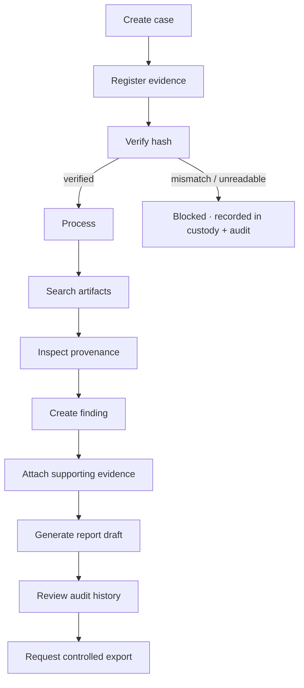

# User workflows

## The core loop

## In the current web UI

The workspace is a single screen: a case list and "create case" on the left; for a
selected case, panels for evidence register (with per-item **Verify** and **Process**
buttons), artifact search, provenance chain, examiner findings, report draft, and audit
history.

Login and demo credentials are in the [README](../README.md#3-run-the-web-app).

## Interface states

The product's target is to make each of these visible and distinct:

loading · empty results · processing · processing failure · permission denied ·
unsupported evidence · hash mismatch · successful verification · no findings ·
missing provenance · unsaved changes.

V0.1 shows error, empty, verified, and mismatch states; explicit loading and
unsaved-change handling are still to come.

Related: [02 User investigation workflow diagram](diagrams/02-user-investigation-workflow.md).
