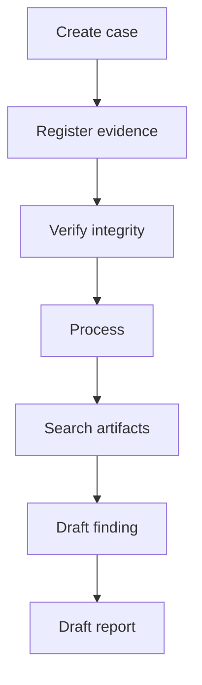

# User investigation workflow

```mermaid
flowchart TD
  C[Create case] --> E[Register evidence]
  E --> V[Verify integrity]
  V --> P[Process]
  P --> S[Search artifacts]
  S --> F[Draft finding]
  F --> R[Draft report]
```
