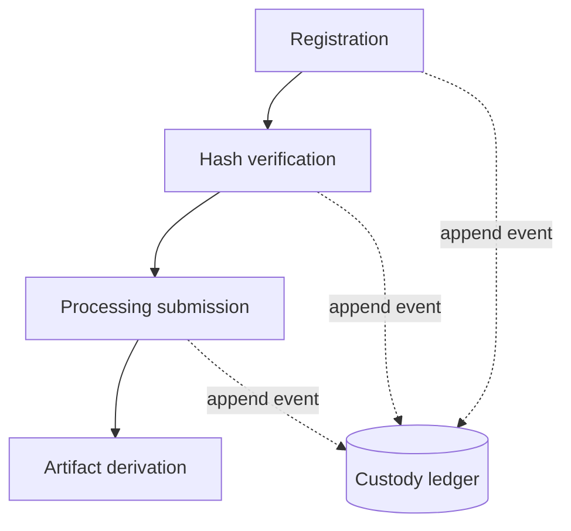

# Chain-of-custody event flow

```mermaid
flowchart TD
  A[Registration] --> B[Hash verification]
  B --> C[Processing submission]
  C --> D[Artifact derivation]
  A -.append event.-> L[(Custody ledger)]
  B -.append event.-> L
  C -.append event.-> L
```
