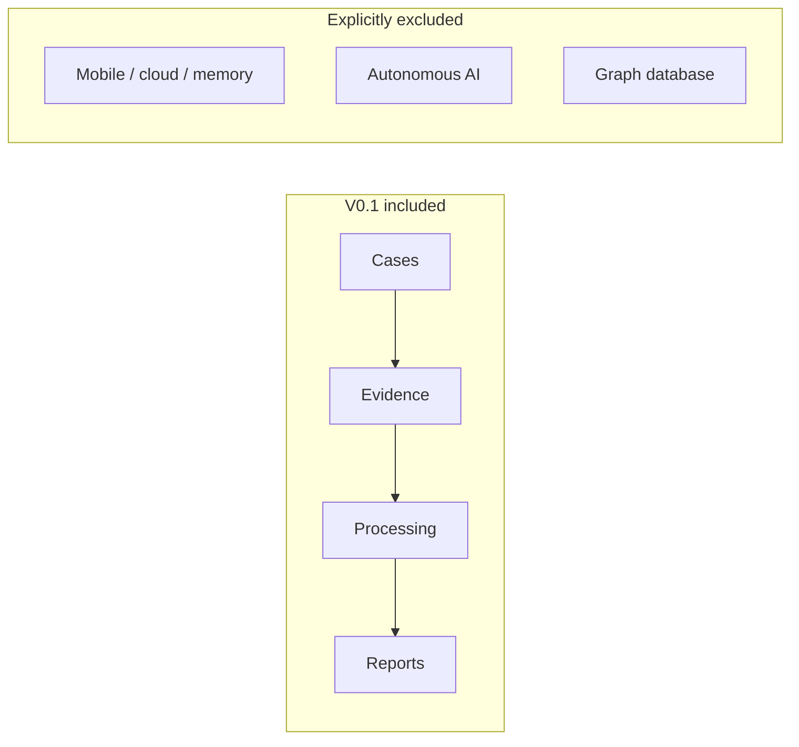

# V0.1 scope boundary

```mermaid
flowchart LR
  subgraph INCLUDED[V0.1 included]
    C[Cases] --> E[Evidence] --> P[Processing] --> R[Reports]
  end
  subgraph EXCLUDED[Explicitly excluded]
    M[Mobile / cloud / memory]
    AI[Autonomous AI]
    G[Graph database]
  end
```
