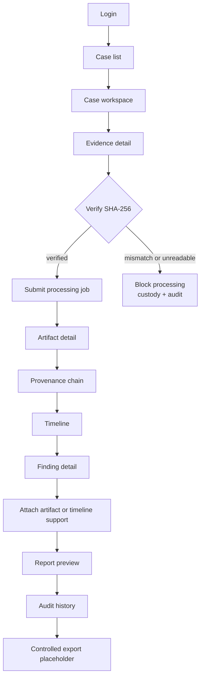

# Core investigator workflow

```mermaid
flowchart TD
  L["Login"] --> C["Case list"] --> W["Case workspace"]
  W --> E["Evidence detail"] --> V{"Verify SHA-256"}
  V -->|verified| P["Submit processing job"] --> A["Artifact detail"]
  V -->|mismatch or unreadable| B["Block processing<br/>custody + audit"]
  A --> PR["Provenance chain"] --> T["Timeline"]
  T --> F["Finding detail"] --> S["Attach artifact or timeline support"]
  S --> R["Report preview"] --> H["Audit history"]
  H --> X["Controlled export placeholder"]
```
