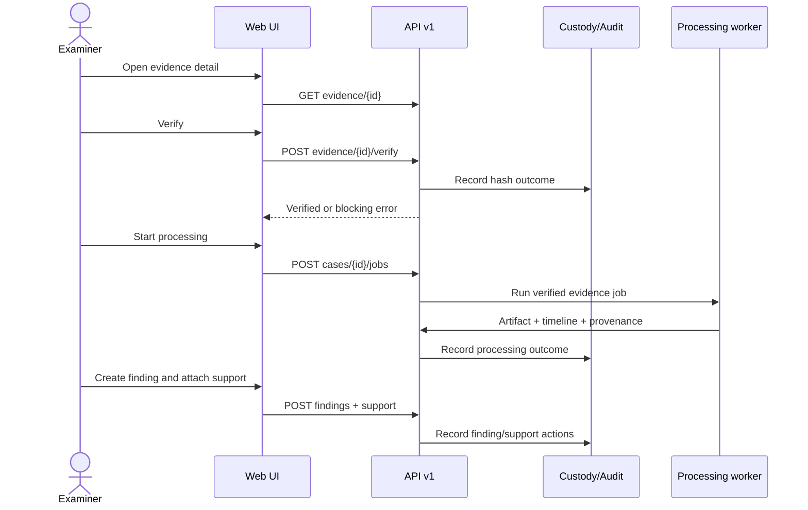

# Evidence-to-finding sequence

```mermaid
sequenceDiagram
  actor Examiner
  participant Web as Web UI
  participant API as API v1
  participant Ledger as Custody/Audit
  participant Worker as Processing worker
  Examiner->>Web: Open evidence detail
  Web->>API: GET evidence/{id}
  Examiner->>Web: Verify
  Web->>API: POST evidence/{id}/verify
  API->>Ledger: Record hash outcome
  API-->>Web: Verified or blocking error
  Examiner->>Web: Start processing
  Web->>API: POST cases/{id}/jobs
  API->>Worker: Run verified evidence job
  Worker->>API: Artifact + timeline + provenance
  API->>Ledger: Record processing outcome
  Examiner->>Web: Create finding and attach support
  Web->>API: POST findings + support
  API->>Ledger: Record finding/support actions
```
