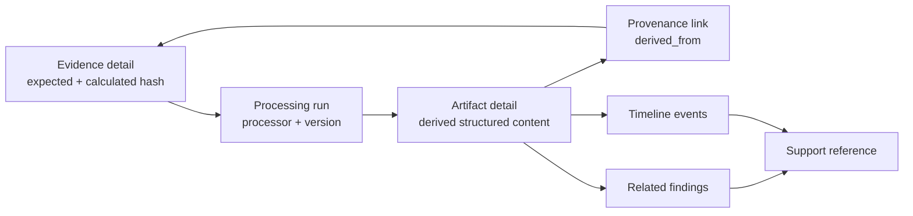

# Artifact provenance navigation

```mermaid
flowchart LR
  E["Evidence detail<br/>expected + calculated hash"] --> R["Processing run<br/>processor + version"]
  R --> A["Artifact detail<br/>derived structured content"]
  A --> PL["Provenance link<br/>derived_from"]
  A --> T["Timeline events"]
  A --> F["Related findings"]
  PL --> E
  F --> S["Support reference"]
  T --> S
```
