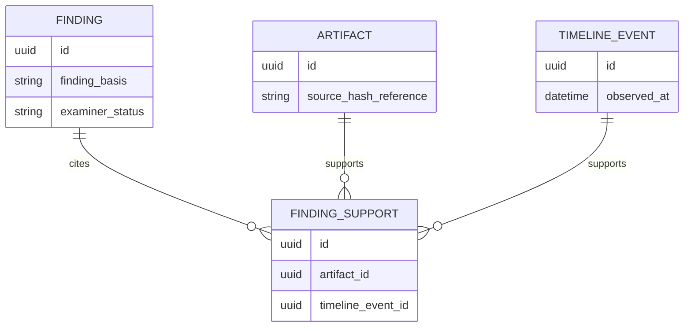

# Finding-support relationship

```mermaid
erDiagram
  FINDING ||--o{ FINDING_SUPPORT : cites
  ARTIFACT ||--o{ FINDING_SUPPORT : supports
  TIMELINE_EVENT ||--o{ FINDING_SUPPORT : supports
  FINDING {
    uuid id
    string finding_basis
    string examiner_status
  }
  FINDING_SUPPORT {
    uuid id
    uuid artifact_id
    uuid timeline_event_id
  }
  ARTIFACT {
    uuid id
    string source_hash_reference
  }
  TIMELINE_EVENT {
    uuid id
    datetime observed_at
  }
```
