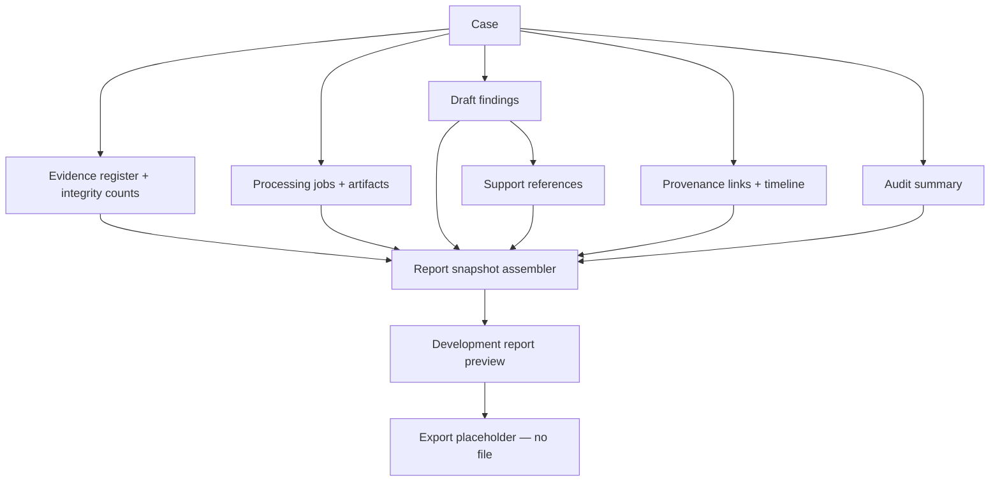

# Report-generation flow — Step 2

```mermaid
flowchart TD
  C["Case"] --> E["Evidence register + integrity counts"]
  C --> J["Processing jobs + artifacts"]
  C --> F["Draft findings"]
  F --> S["Support references"]
  C --> P["Provenance links + timeline"]
  C --> A["Audit summary"]
  E --> D["Report snapshot assembler"]
  J --> D
  F --> D
  S --> D
  P --> D
  A --> D
  D --> R["Development report preview"]
  R --> X["Export placeholder — no file"]
```
