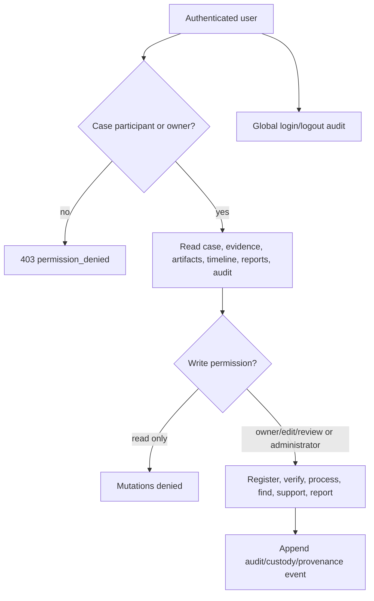

# User permission flow

```mermaid
flowchart TD
  U["Authenticated user"] --> Q{"Case participant or owner?"}
  Q -->|no| D["403 permission_denied"]
  Q -->|yes| Read["Read case, evidence, artifacts, timeline, reports, audit"]
  Read --> W{"Write permission?"}
  W -->|read only| D2["Mutations denied"]
  W -->|owner/edit/review or administrator| Mut["Register, verify, process, find, support, report"]
  Mut --> L["Append audit/custody/provenance event"]
  U --> G["Global login/logout audit"]
```
