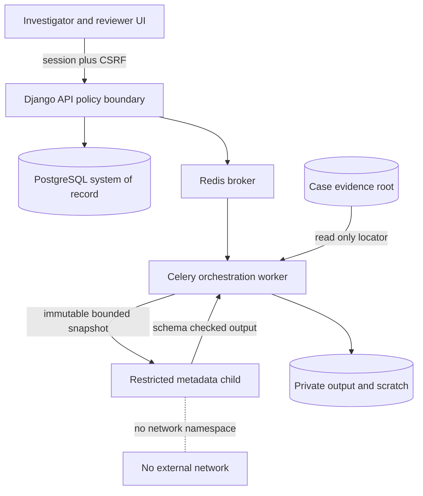
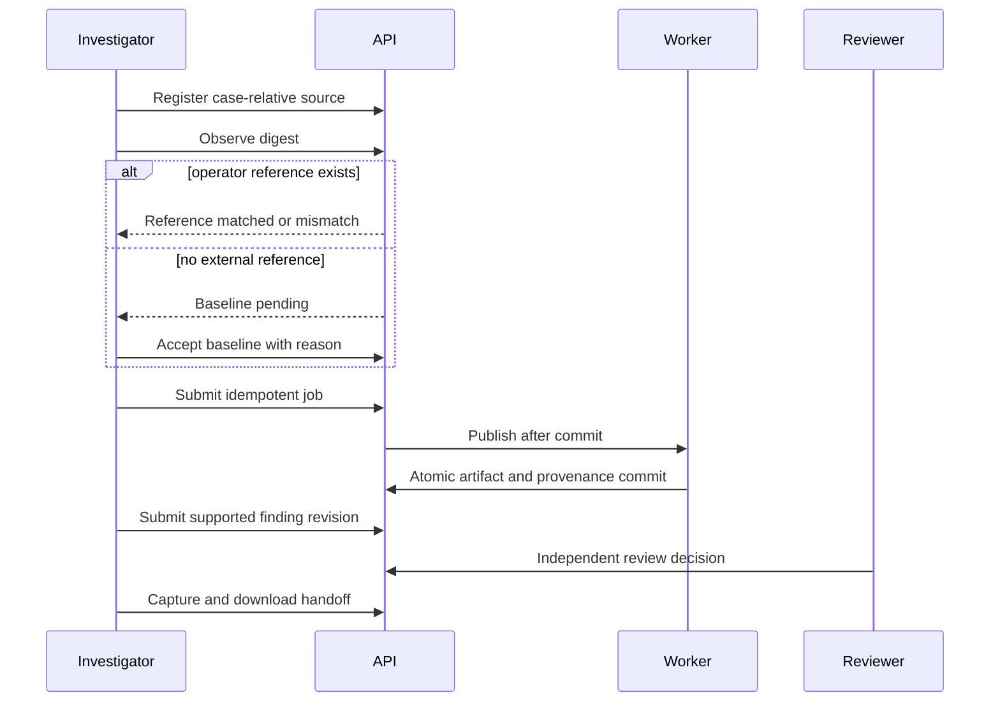
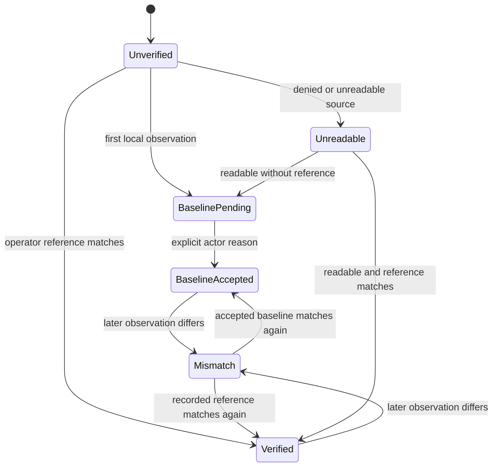
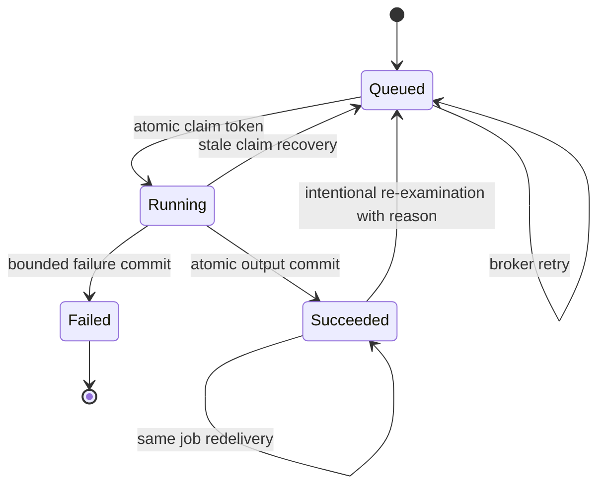
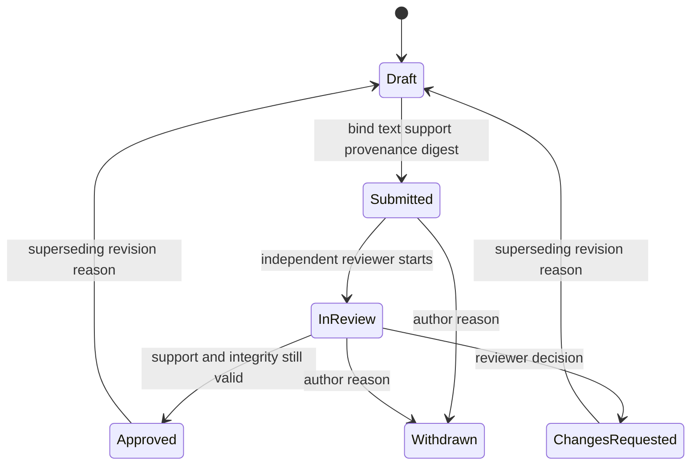
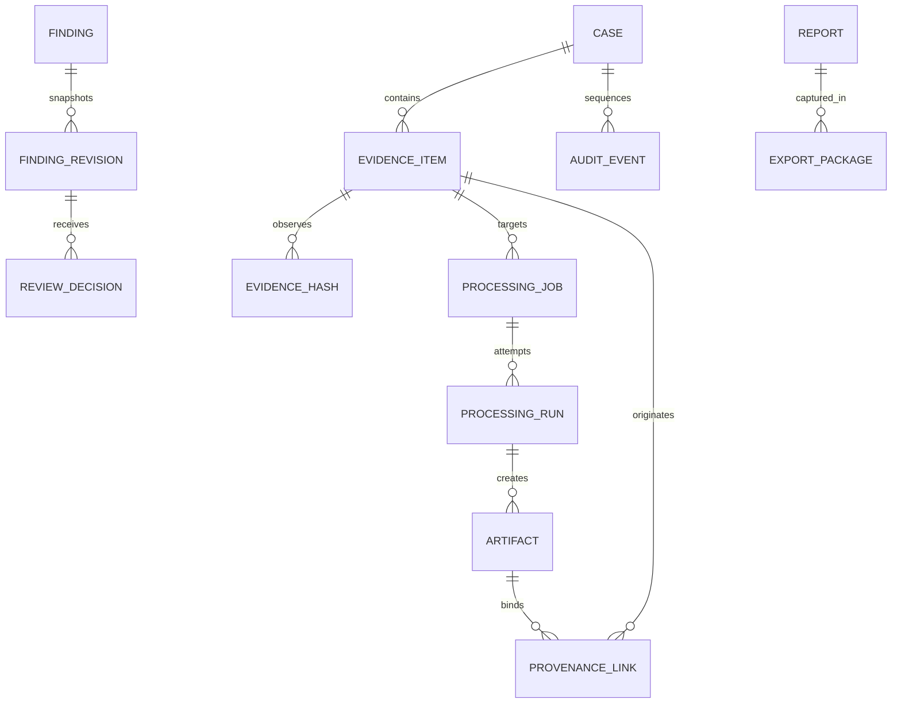
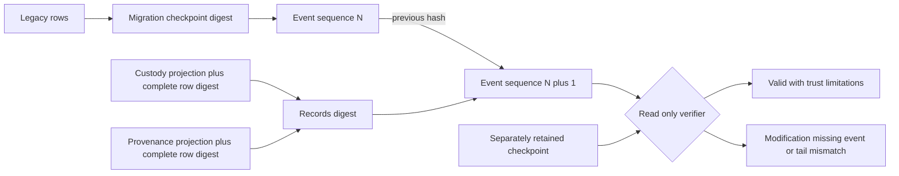
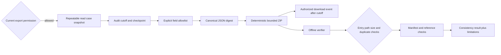

# Phase 3 trust boundaries and workflows

These eight diagrams are the maintained Phase 3 system views. Generated SVGs live in
`docs/generated/phase3`; the verifier parses and renders every changed source.

## Architecture and trust boundaries

## User and engine workflow

## Evidence states

## Job and retry states

## Finding revision review

## Data relationships

## Event verification

## Export generation and verification

